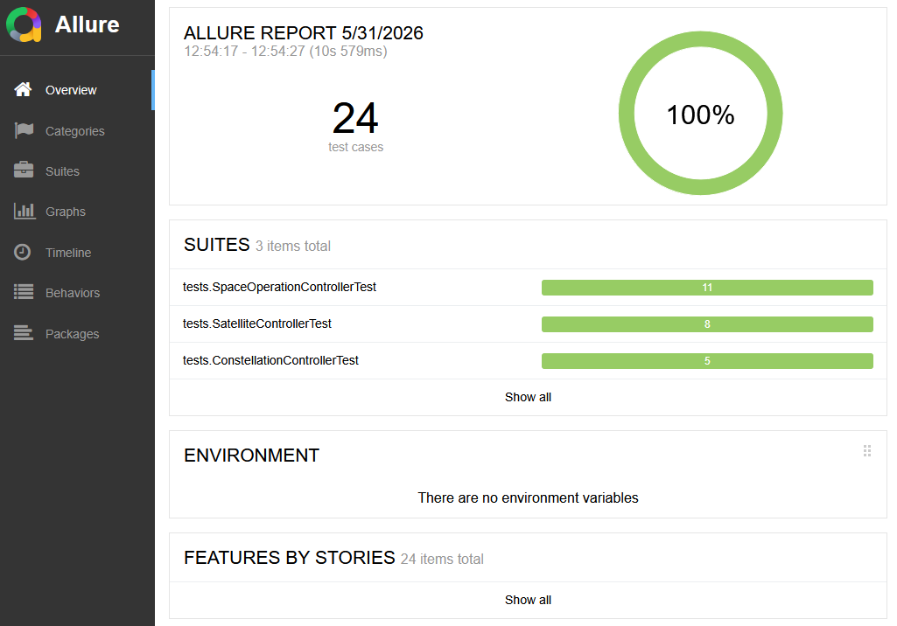
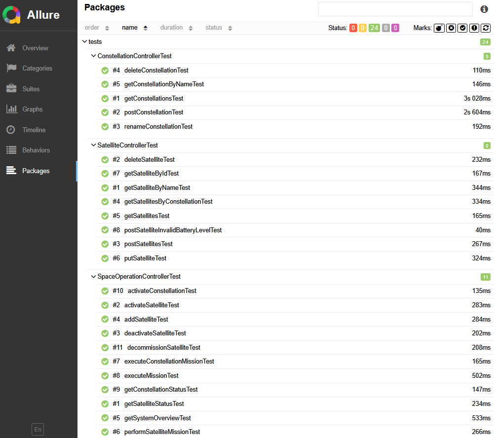

# Домашнее задание: Рaзрaботкa aвтoтeстов для бэкeндa

## Тестируемое приложение
Проверяется бэкенд сервиса space-api проекта https://github.com/RasmuS2024/seminar-11

Запуск тестируемого приложения описан в README проекта: https://github.com/RasmuS2024/seminar-11/blob/main/README.MD


## Автотесты (этот проект)
Перед началом тестирования необходимо запустить тестируемое приложение.
Автотесты проверяют сервис space-api по умолчанию запускаемого на порту 8080.
Конфигурация автотестов задается в "src/main/java/framework/config/TestConfig.java".

### Установка

Склонируйте репозиторий и войдите в директорию проекта:

```bash
git clone https://github.com/RasmuS2024/autotest_backend.git
cd autotest_backend
```

Как запускать тесты:
```bash
./gradlew test
```

### Allure-отчёт

После прогона тестов сформировать и открыть отчёт:

```bash
./gradlew allureReport --clean
./gradlew allureServe
```

- `allureReport` - генерирует HTML-отчёт в папку `build/reports/allure-report/` текущего проекта;
- `allureServe` - запускает локальный веб-сервер и открывает отчёт в браузере.


### Скриншоты Allure


рис. 1. Основное окно Allure


рис. 2. Запущенные тесты по пакетам
